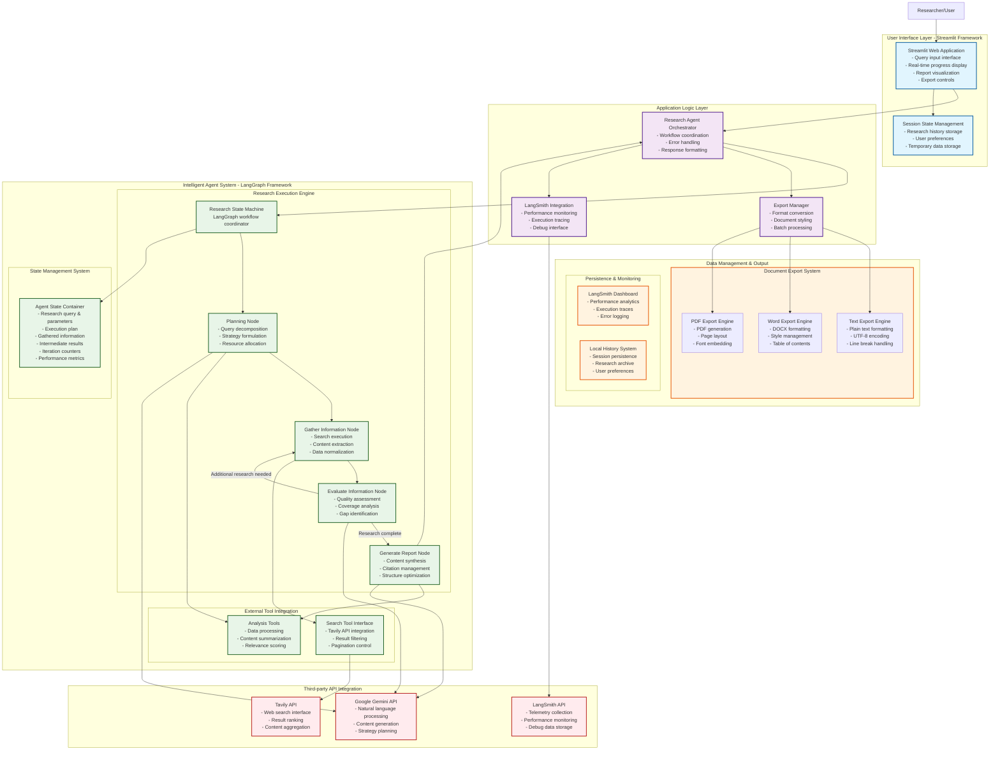

# DigDeeper Project Details

## Overview

DigDeeper is an autonomous AI-powered research assistant that leverages Streamlit, LangGraph, and Google Gemini to automate the entire research process. This sophisticated system transforms simple queries into comprehensive, citation-rich research reports through an intelligent multi-step workflow that plans, gathers, evaluates, and synthesizes information from web sources.

## Key Features

### 🔍 Automated Research Workflow
- **Intelligent Query Planning**: Decomposes complex research questions into targeted search queries
- **Multi-source Information Gathering**: Utilizes Tavily API for comprehensive web search
- **Adaptive Evaluation System**: Determines information sufficiency and identifies knowledge gaps
- **Structured Report Generation**: Produces well-organized reports with proper citations and references

### 📊 Export Capabilities
- **Multiple Format Support**: Export reports as TXT, DOCX, or PDF
- **Professional Formatting**: Maintains structure and citations across all export formats
- **One-click Download**: Simple interface for immediate access to research results

### 🔬 Advanced Features
- **Markdown Report Preview**: Real-time rendering of formatted research reports
- **LangSmith Integration**: Optional tracing for debugging and performance analysis
- **Research History**: Persistent session storage for revisiting previous research
- **Iterative Refinement**: Multiple search cycles for comprehensive coverage

## System Architecture

## Technical Implementation Details

### Core Components

#### 1. Research Agent Engine
- **LangGraph State Machine**: Coordinates the multi-step research process
- **Modular Node Design**: Each functionality is encapsulated in separate nodes
- **Conditional Workflow**: Adaptive execution based on research quality assessment

#### 2. Intelligent Planning System
- Query analysis and decomposition strategy
- Search term optimization and prioritization
- Resource allocation and iteration planning

#### 3. Information Gathering Module
- Tavily API integration for comprehensive web search
- Result filtering and relevance scoring
- Content extraction and normalization

#### 4. Evaluation & Synthesis Engine
- Information quality assessment metrics
- Coverage analysis and gap identification
- Content synthesis and citation management

### Data Flow Process

1. **Input Processing**: User query reception and initial analysis
2. **Query Decomposition**: Breaking down complex questions into searchable components
3. **Search Execution**: Parallel web search using optimized queries
4. **Content Evaluation**: Assessing gathered information for completeness and quality
5. **Iterative Refinement**: Additional searches based on identified gaps
6. **Report Synthesis**: Organizing information into structured format with citations
7. **Output Generation**: Formatting and delivering final research report

### Integration Points

- **Google Gemini API**: Powers natural language understanding and generation
- **Tavily Search API**: Provides comprehensive web search capabilities
- **LangSmith Platform**: Offers performance monitoring and debugging tools
- **Streamlit Framework**: Delivers responsive web interface

## Performance Characteristics

- **Multi-iteration Research**: Adaptive search refinement based on quality assessment
- **Parallel Processing**: Efficient handling of multiple search queries
- **Memory Management**: Optimized state handling throughout research process
- **Error Resilience**: Robust error handling and recovery mechanisms

## Usage Scenarios

### Academic Research
- Literature review automation
- Source identification and citation
- Research gap analysis

### Business Intelligence
- Market research automation
- Competitive analysis
- Trend identification

### Content Creation
- Research-backed content generation
- Fact-checking and verification
- Source documentation

## Development Roadmap

### Future Enhancements
- Scoping, to get a better context before research
- Multi-language research support
- Domain-specific search optimization
- Collaborative research features
- Advanced visualization capabilities
- Integration with academic databases
- Custom citation style support

---

**Built by Karagwa** | **Powered by LangGraph, Google Gemini, Tavily, and Streamlit**

*DigDeeper represents the cutting edge of AI-assisted research technology, combining sophisticated language understanding with comprehensive web search capabilities to deliver professional-grade research reports through an intuitive interface.*